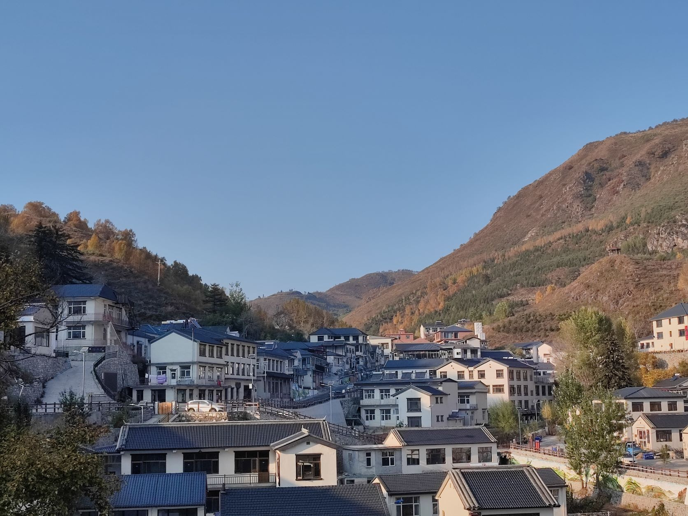
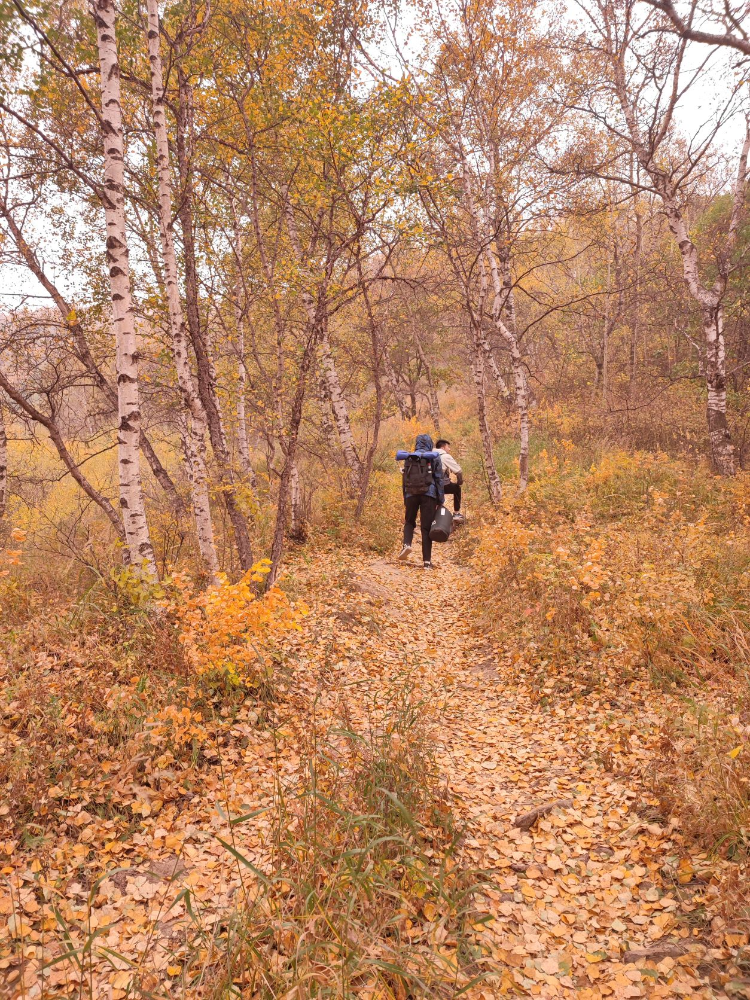
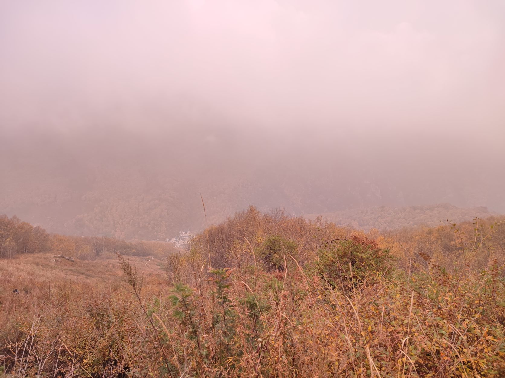
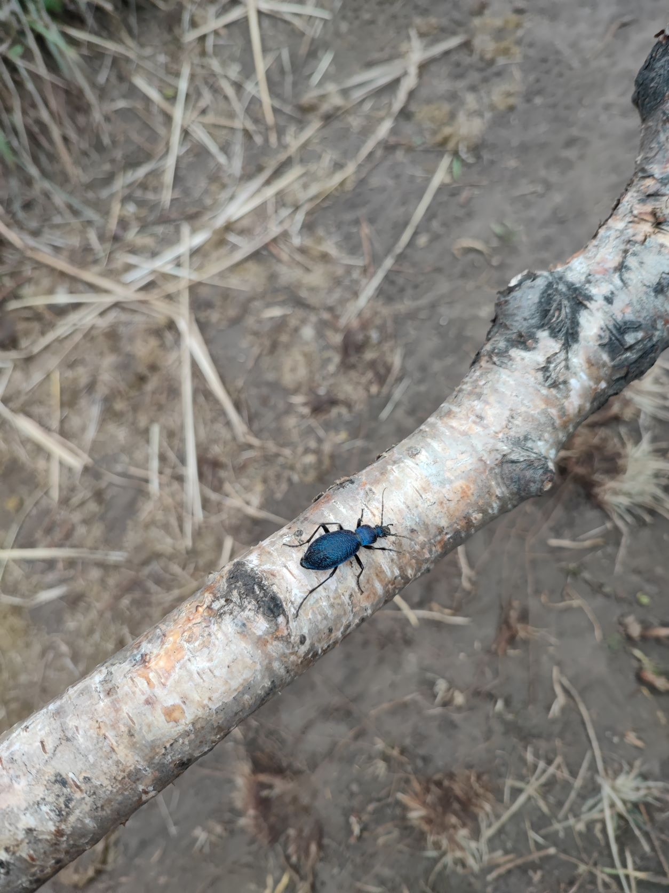
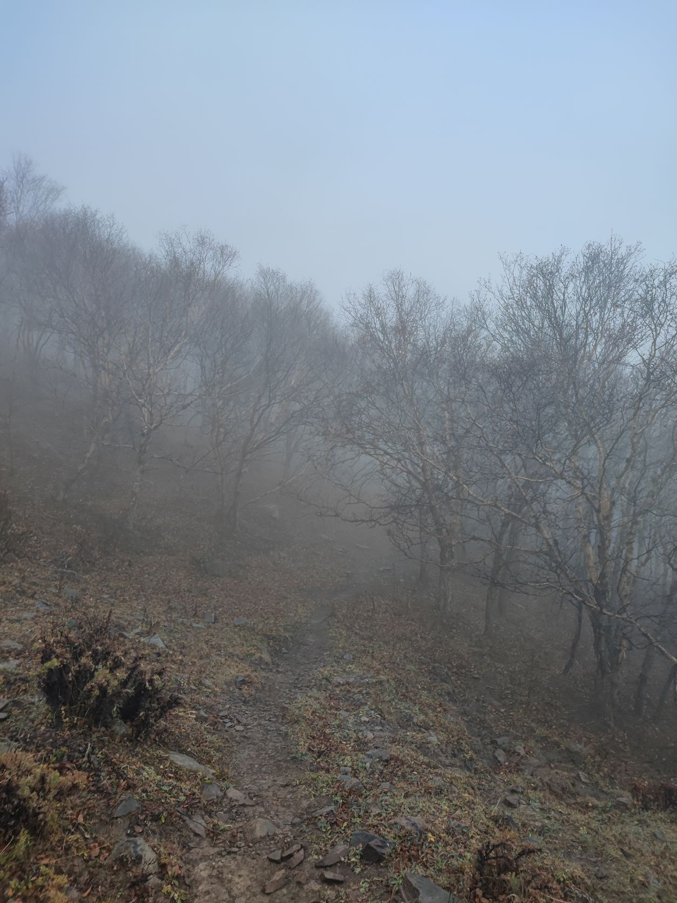
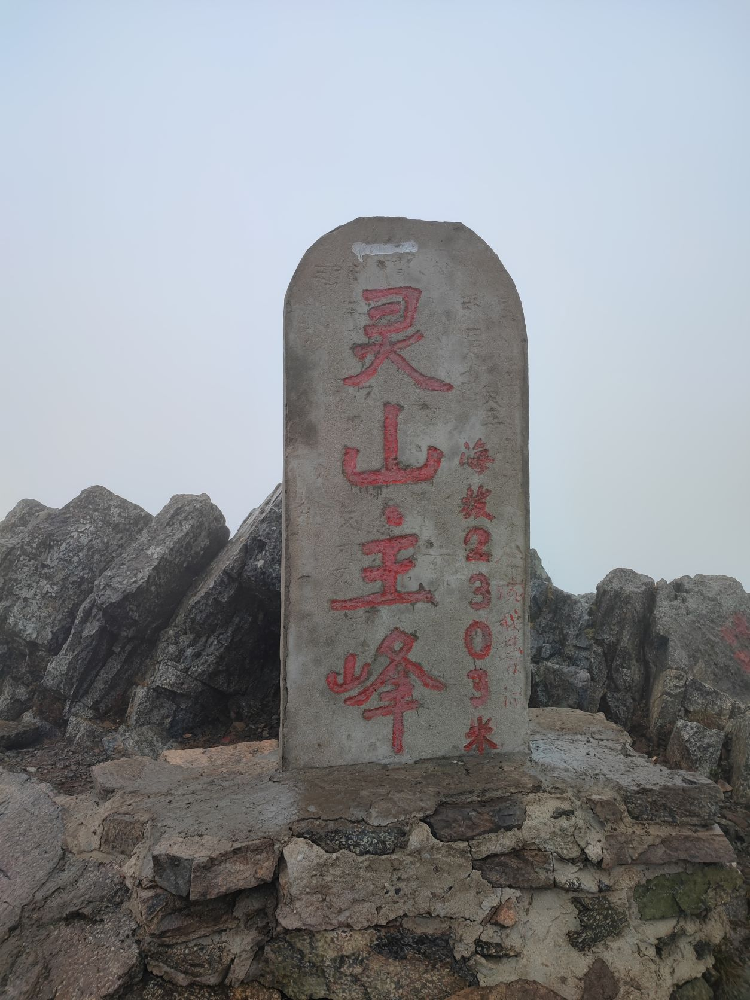

## 准备

<!-- :more -->

露营在我心里的印象是什么样的？河边的林间空地上，一顶帐篷、一堆篝火、几块大石或者小凳，潺潺水声、窸窣虫鸣、满天星光，烤肉的香气、爆发的笑声、轻快的旋律。

因此我一直想要露营，和朋友一起。而这个愿望可能实现的最近时间，就是这个十一假期。朋友就是在大学认识的两个兽友[^furry]，亓官和亮。

<!-- more -->

我很早就把这个想法告诉了他们两个，但真正开始计划行程还是在开学之后。我们三个见了两次面才把总体的计划确定下来。地点选择了东灵山，根据亓官得到的峰云社[^fengyun]同学的建议。路线和要准备的物资则又在之后反复调整了多次。直到出发前几天，我们才准备好所有该准备的东西。

[^furry]: Furry 朋友。
[^fengyun]: 学校的一个户外活动社团。

## 启程

由于国庆假期被缩短成 3 天，我们决定请假来提前一天出发。9 月 30 日早晨，我们带上了所有物资离开学校，坐上了离开市区的公交车[^bus]。

光是离开市区就花了几个小时，途中我们还在返回时也会经过的地点寄存了电脑。当公交驶入门头沟区，窗外的景色终于开始变得不一样。群山吞没了这辆不大的公交车。永定河在道路北侧蜿蜒相伴[^company]，时而形成一道跌水吸引我们的目光。随着车辆深入山间，海拔也在增加，周围的草木逐渐由绿转黄，还有少数红叶夹杂其中。

刚刚进山的体验总是很新鲜的，一路上我们聊天都没怎么停止过。亓官和亮学的都是与生物相关的专业，我们一路上聊了很多有关植物的话题。到这时亮才想起来，他之前的一次实习正是在东灵山。不过尽管来过一次，但目的不同，体验也截然不同了。

坐了两个多小时的车后，我们到达了终点站——斋堂镇。我们要坐的下一趟车还要一个小时才发车，于是我们在当地吃了午饭。店家人很好，做的面条还是手擀的，价格便宜而美味。之后，我们再一次上车，绕着盘山公路开了一个半小时，来到了又一个终点站。这里就是我们的徒步将要开始的地方了。

[^bus]: 我们中并没有人已经拿到驾照；而为了省钱，我们也不打算打车。
[^company]: 严格来说不能算相伴，因为我们是逆流而上。

## 村庄

<figure>
  
  <figcaption>

  **图**：江水河村

  </figcaption>
</figure>

<figure style="margin-top: 0;">
  
  <figcaption>

  **图**：沙棘

  </figcaption>
</figure>

<figure>
  
  <figcaption>

  **图**：林间小径

  </figcaption>
</figure>

江水河村，海拔 1400 米，是北京海拔最高的村庄。刚一下车，扑面而来的凉气就让我们感受到了海拔的影响——这里已经完全进入深秋季节。我们到达时已经是傍晚，夕阳斜照在小村西面的山坡上，令漫山的黄叶更加耀眼。

在预定好的民宿稍作休息后，我们先逛了逛村子西侧修建好的步道。步道两边长满了各种杂草，让亓官和亮两人好好复习了一次植物学知识。山上的植物不少都是市区不常见的。有一些沙棘树上长满了沙棘，我们还尝了几粒；有一些则一粒都没长，反而粘满了毛毛虫。

天色渐晚。我们原本打算在村里吃晚饭，但村里的正餐贵得离谱，我们最终也没有吃饭，只是用带来的食物填了肚子。晚上是我们三个人都参加了的 CoC 网团[^coc]，从七点半持续到了半夜。之后，我们便在聊天中入了睡。第二天早晨，我们在民宿吃了早餐，做了核酸[^covid test]，买了水，便离开村庄向山上进发。

[^coc]: CoC 是一种克苏鲁神话主题的 TRPG 规则。TRPG，Tabletop Roleplaying Game，桌面角色扮演游戏。
[^covid test]: “在中国，有人的地方就有核酸检测点。”——亮

出发时，山上已经笼罩了朦胧的雾气，看不到太阳。最开始的一段路穿行在金黄的落叶林中，脚下裸露的树根围起泥土构成了台阶，上面覆盖满了落叶。这段路坡度很大，我们很快便上升到了可以俯瞰整个村庄的高度。在白色的天空下，远处的小村已经变得朦胧。没过多久，我们便走出了树林，来到了草丛中。

<figure>
  
  <figcaption>

  **图**：俯瞰村庄

  </figcaption>
</figure>

## 旅程

随着海拔上升，我们周围的植被很快变成灌木丛，接着又转为了草甸。离开了乔木的遮蔽，风力便大了起来。飘浮的水滴从我们周围高速流过，分不清是雾还是云。尽管没有下雨，但我们的发梢上都沾满了水珠。

距离登顶还有一段漫长的旅程。路上偶尔遇到一些特别的东西，比如一棵在巨石上横生而出的树、一只少见的蓝色型绿步甲[^smaragdinus]。还有不时出现的马铃声，那是收费送游客上山的马队。我们已经到达放牧区，空气中弥漫着淡淡的马粪臭味，然而今天天气不好，并没有看到牛羊群出现。

[^smaragdinus]: 事后查到的结果。当时只知道这是一种不常见的昆虫。

<figure style="margin: 0;">
  
  <figcaption>

  **图**：横生的树

  </figcaption>
</figure>

<figure style="margin: 0;">
  
  <figcaption>

  **图**：蓝色型绿步甲

  </figcaption>
</figure>

<figure>
  
  <figcaption>

  **图**：山间远景

  </figcaption>
</figure>

途中大部分路都是土路。大约走了五分之四的路程后，才有断断续续的石板路出现。但在那天的天气下，湿滑的石板给人的感觉还不如泥土可靠。海拔依然在上升。中途还能看到几片长在草地中间的树林，但都已经掉光了叶子，完全是一幅冬季的景象。

在距离主峰不远处，我们到达了一个补给站，里面提供热水、奶茶、泡面和烤串，还有 Wi-Fi 信号——这一带几乎都没有手机信号了。一个看起来经验丰富的露营者给了我们一些建议：下午一点要下雨，我们没带雨衣，应该在这里买一件；我们的装备不足以在顶峰附近露营，是时候在这附近找一处合适的扎营地了。

## 风与雨

或许第一次露营就选择东灵山并不是个好主意。

这里的海拔已经很高了，地面上的草已经稀疏到足以露出泥土。带着冰冷水雾的寒风席卷着这片荒凉的地域，我们很难找到一块风力能小哪怕一点的平坦地面。顺着那位前辈的指示，我们逛了许久才最终决定在一块大石的背风面扎营。

下一个问题是我们缺乏准备。我们三个都没有扎营的经验。尽管出发前帐篷一直在我手上，但我也没找到时间来练习一次扎营。于是，这次我们是要在完全没有准备的情况下，在这样一个恶劣的环境中度过这个夜晚。即使不需要搭帐篷，我的手也已经被吹得冰凉，更何况要完成这样一件复杂的任务……

尽管如此，帐篷还是勉强搭建起来了。只是被狂风吹得严重变形，迎风方向向内压了几十厘米；而原本应该贴地的雪裙在背风面飞舞着，不断拍打地面，将泥沙鼓入帐篷中。一搭好帐篷，我们就急忙把所有物资丢了进去，然后进入帐篷关紧帐门。

渺小的帐篷被风吹得瑟瑟发抖，进入帐篷的泥沙散发着令人不适的马粪味。尽管如此，至少帐篷里没有风寒，有三个人在散发着热量，帐篷里还是逐渐暖和了起来。下午一点已经过了，但前辈提到的雨仍未到来。我们拿出了还没吃的午饭，饭后又休息了两个小时。

很难说清雨到底是什么时候开始的，起初的几粒雨滴被掩盖在风声中，之后便是一波波雨珠泼过的哗啦声。接下来都没法离开帐篷了。天空渐渐暗了下来，我们点起灯，玩了一两个小时的牌——有扑克牌，也有 UNO。时间不知不觉地过去，之后是晚饭。夜晚的雨停了片刻，亓官和亮两人出帐篷在黑暗中上了厕所。再之后，雨重新下了起来，到鬼故事时间了。

## 故事三则

### 一

这是一个在北京流传已久的都市传说。

许多年前的一个深夜，一个年轻小伙匆匆赶上了一趟末班车。因为时间已经很晚，车上人不多，除了司机和售票员以外，只有一个老太太和一对年轻夫妇。

公交车停在了一个车站，一位身穿红色连衣长裙、戴着红色礼帽的的女子投币上了车，高跟鞋踩在车地板上发出了空灵的哒哒声。接着，公交车重新发动，夜晚重归宁静。

突然，那位老太太疯了似地说小伙偷了她的钱包，要求下车去派出所理论。小伙一头雾水，但抵抗不住老太太的怒气，他们两人在下一站下了车。这时老太太才道出真相：那位红衣女子的长裙下，根本没有腿。

第二天的新闻报道，一辆公交车在郊区发生侧翻，无人生还。

### 二

这是在即兴跑团中产生的情节。

两个童年的玩伴，现在的好朋友，结伴登山露营。高山夜晚，风声大作，雪粒横飞。其中一个睡不着觉，又恰好内急，便出了帐篷解决。

帐篷外漆黑一片，寒冷刺骨。就在他解决完毕想要返回时，雪突然加大，遮蔽了视线，他再也找不到帐篷的位置。兜兜转转，寒冷正一寸寸渗入体内，就在这时，不远处一点白光亮起。他只能把这当作一丝生机，向那里走去。

出乎他的意料，里面竟然是一个温馨小屋的景象。有沙发、茶几，一个壁炉正散发着暖意。小屋另一边有个黑洞洞的出口，他不敢进入，只在原地休息。然而片刻过后，背后的房门突然关闭，仿佛门消失在墙壁上一般天衣无缝。

此时，他的同伴也被狂暴的风声吵醒。醒来的同伴发现身边的人不知去处，睡袋内早已冰凉，急忙带上手机出帐篷寻找。然而外面一片漆黑，唯有不远处的一点白光。当他靠近那里时，白光突然消失，于是他打开手机手电筒，发现自己竟身处一个洞穴，而洞中地面上散布着的，是森森的白骨。

洞穴里还有一个漆黑的出口，但他已经不敢再深入，只好靠着手电筒返回帐篷，点亮帐篷灯，期望着同伴何时能够返回。

而他的同伴见到房门关闭，不得不离开温暖的房间进入黑漆漆的出口。出口外似乎依然是个房间，但缺少照明，什么都看不到。幸好他也带了手机，尽管电量告急。他开启片刻手电筒找到了电灯开关，打开开关，发现这看起来像个生物实验室。桌面上放着各类实验仪器和容器，但都已经蒙上一层薄薄灰尘。实验室同样只有一个出口，于是他小心地避开仪器走到出口。然而电灯的供电也已经不稳定，恰好熄灭在了他踏出实验室的那一刻。

靠着手机最后的电量，他看清了这是一条狭长的走廊，两边已经筑满了蛛网。穿过走廊，手机终于没电了。他摸着墙壁，能感觉到这是个天然洞穴。靠着洞壁行走，脚下不知踩到何物，发出阵阵“喀哒”声响。终于，他感到有雪落在身上，洞外不远处只有一点暗淡灯光。

他喊出了同伴的名字，答复是肯定的。

他向那光亮走去，两人在雪中相拥而泣。

### 三

这是一个即兴故事。

大约是在地理大发现时期，一队经验丰富的探险者正要进入一座废弃的阿兹特克式的金字塔。他们装备齐全，整装待发。

踏入金字塔，一阵潮湿腐败的气息便扑面而来。探险者们早已习惯了这种气味，点亮了煤油灯照亮阴暗的地穴。

通过一道狭长的走廊，他们被一堵石门所阻挡。石门上有把手，但谨慎的领队担心把手上会有机关，用撬棍十分费力地把石门撬开了一道足够一人通过的缝隙。

穿过这道门，探险队进入了一个小房间，中间看起来是一个火塘，对面是另一扇门。房间里似乎回荡着窸窸窣窣的声音，但找不到来源。对面的门上方是一张石刻的脸，似乎警告着这些图谋不轨的来访者。

但在找到想要的东西前，他们不会轻易放弃。领队把灯放在地上，故技重施地敲开了这扇门。就像有一阵风从门里吹出，油灯灭了。房间陷入了黑暗。

领队让大家冷静下来。这通常是因为洞中积累了二氧化碳，只要施放掉就安全了。于是他们提起灯重新点燃，稍等了片刻，把灯伸进门，已经不再熄灭了。于是探险者们放下了警惕，挤进了下一个房间。

就在这个房间，探险队渴望的东西出现了。那是大批的金银财宝，堆放在房间中央的石台上。这个房间没有任何其它出口，墙上也没有装置的迹象。确认安全后，领队拾起了财报堆顶上的一枚金币。

就在这时，背后房间里似乎传来了石门推开的声音。

接着，窸窸窣窣的声音传来，越来越响、越来越近。一大片虫子，各式各样的虫子，涌进了这个房间。黑暗、恶心与痛苦淹没了每一个探险队员。

突然，领队在一个帐篷中醒来。每个队员都还在身边，他们依然在金字塔外的营地。大家面面相觑。

所有人一致同意，放弃探索这座神秘的金字塔。

## 雾与山

黑暗中，我们在风雨的考验下睡去。醒来时已经是早上六点，风减小了很多，雨已经停了。取而代之的，是更加浓厚的大雾，浸没了整片草甸。

离开前还要收起帐篷。我们大概花了一个小时才把帐篷完全收纳起来，中间包括清理地钉上的泥土、防止没有支架的帐篷被吹走，等等。沾满了泥水的帐篷收纳起来，体积和重量都比来时增加了，幸好我们途中的食物消耗基本上抵消了这部分增加的重量。当我们整理好背包时，雨衣已经被雾沾湿了。

于是我们启程继续攀登最后的主峰。大雾中只能靠指南针指向，我还带错了一段路，把三人带到了一片氛围神秘的落叶林中。亮在那里采挖了一些苔藓。我们花了好一会才重新找到登顶的主路。

翻过一座山头，穿过一道围墙，我们来到了一个看起来像某种平台的地方。整个平台看起来残破不堪，到处布满大石块和碎石，给人一种废墟般的萧瑟感。平台上有个花坛状的结构，花坛里竟然有一只青蛙，令我们十分惊讶。

继续向山顶前进。最后一段路是铺好的石板路。路边有大大小小的玛尼堆，不知由何人留下。接近山顶，开始有几个登山者出现，不知是和我们一样露营还是起得特别早。我们似乎已经走到了山脊上，两边看起来都十分空旷，只是因为大雾而看不到远处。终于，石板路到了尽头。白雾中，空地上，一座混凝土石碑默然伫立。我们登顶了。

<figure style="margin: 0;">
  
  <figcaption>

  **图**：迷雾森林

  </figcaption>
</figure>

<figure style="margin: 0;">
  
  <figcaption>

  **图**：登顶

  </figcaption>
</figure>

