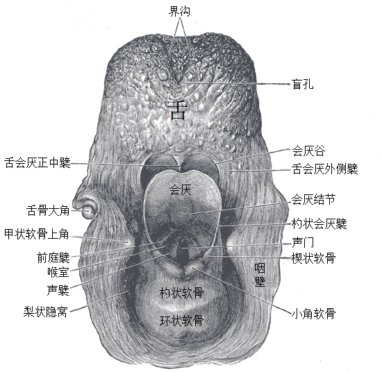
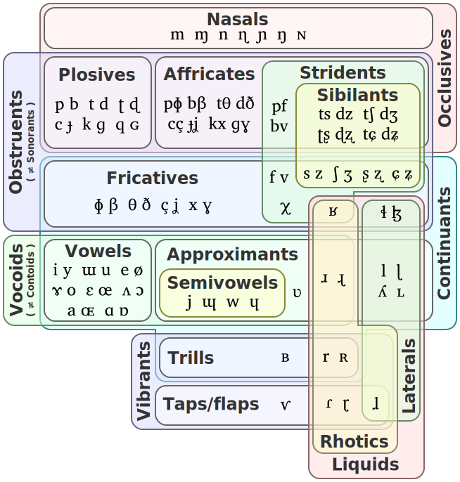
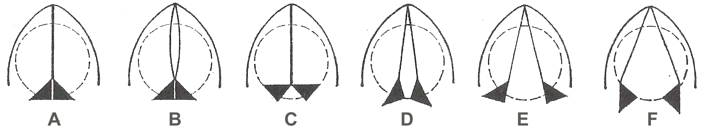

> 本节要点：
>
> - 调音部位：主动与被动；
> - 调音方式：
>   - 阻音（塞音、擦音、塞擦音）；
>   - 响音（颤音、闪音、近音、元音）；
>   - 鼻音和边音；
> - 元音：开闭、前后与圆唇；
> - 清浊音、发声态；
> - 气流机制、非肺部气流辅音；
> - 语音单位：音节、音段、发声态势；
> - 国际音标。

人类的语音，本质上是空气中传播的声波。要制造这些声波，首先需要一个能够容纳空气的空腔，也就是肺、气管、咽腔、口腔和鼻腔；之后需要一个波源，主要是声带；最后还需要一个动力推动空气，让空气流动起来，通常是肺的收缩。这三部分中，每一部分的变化都能造成声音的变化，进而产生丰富的人类语音。

## 调音部位

咽腔、口腔和鼻腔这三个腔体位于声带以上，不光能容纳空气，更重要的是能作为共鸣腔。共鸣腔形状的变化能使音色发生变化，这就叫做**调音**（articulation）。

下图就是人体中各个负责调音的部位。调音部位分为两类，**主动调音部位**和**被动调音部位**。主动调音部位具有肌肉，可以被主动地驱动，而被动调音部位则相对无法运动。调音的一般机制，就是由主动调音部位接近或触碰被动调音部位，从而改变共鸣腔的形状，使音色发生变化或产生噪音。

<figure id="fig-places" class="float">
  
  <figcaption>

  **图**：人体中的调音部位

  </figcaption>
</figure>

这张图中，主动调音部位有：

- 1-2 下唇（labial[^adjective]）；
- 16-18 舌冠（coronal），舌的前部，包括：
  - 17 舌尖（apical）、
  - 16 舌叶（laminal）、
  - 18 舌下（subapical）；
- 14-15 舌面（dorsal）；
- 13 舌根；
- <ruby><rb>杓</rb><rp>（</rp><rt>sháo</rt><rp>）</rp></ruby>状会厌<ruby><rb>襞</rb><rp>（</rp><rt>bì</rt><rp>）</rp></ruby>（aryepiglottal），位于 12 会厌的后方，图中没有标出；
- 11 声门，即两瓣声带之间的开口（glottal）。

[^adjective]: 列表中括号里的英文都是各个部位的形容词形式，下同。

<figure class="float">
  
  <figcaption>

  **图**：咽喉的后视图

  </figcaption>
</figure>

被动调音部位有：

- 1-2 上唇（labial）；
- 3 齿（dental）；
- 4 龈（alveolar）；
- 5 龈的后部，简称龈后（post-alveolar）；
- 6-7 硬腭，常简称腭（palatal）；
- 8 软腭（velar）；
- 9 小舌，学名悬雍垂（uvular)，即软腭后端下垂的末端；
- 10 咽（pharyngeal）；
- 12 会厌（epiglottal）。

一个主动调音部位接触或接近一个被动调音部位，就得到了一类音。所以：

- 下唇接触上唇，就是*双唇辅音*（bilabial consonant），例如普通话“<ruby><rb>八</rb><rp>（</rp><rt>bā</rt><rp>）</rp></ruby>”中的“b”；
- 下唇接触齿，就是*唇齿辅音*（labiodental consonant），例如普通话“<ruby><rb>发</rb><rp>（</rp><rt>fā</rt><rp>）</rp></ruby>”中的“f”；
- 舌尖接触上唇，就是*舌唇辅音*（linguolabial consonant），如 Tangoa[^tangoa]“p̈ep̈e”中的“p̈”，这类音非常少见；
- 舌尖接触齿，就是*齿辅音*（dental consonant），例如英语“this”中的“th”；
- 舌尖接触龈，得到*龈辅音*（alveolar consonant），例如普通话“<ruby><rb>那</rb><rp>（</rp><rt>nà</rt><rp>）</rp></ruby>”中的“n”；
- 舌叶接触龈后，得到*龈后辅音*（post-alveolar consonant），例如英语“share”中的“sh”；
- 舌面接触硬腭，得到*硬腭辅音*（palatal consonant），例如<audio class="audio-clip" controls src="pronunciation_ja_ひと.mp3"></audio>日语“<ruby lang="ja"><rb>人</rb><rp>（</rp><rt>ひと</rt><rp>）</rp></ruby>”中“<ruby><rb>ひ</rb><rp>（</rp><rt>hi</rt><rp>）</rp></ruby>”中的“h”；
- 舌根接触软腭，得到*软腭辅音*（velar consonant），例如普通话“<ruby><rb>卡</rb><rp>（</rp><rt>kǎ</rt><rp>）</rp></ruby>”中的“k”；
- 舌根接触小舌，得到*小舌辅音*（uvular consonant），例如<audio class="audio-clip" controls src="pronunciation_de_rad.mp3"></audio>德语“Rad（车轮）”中的“r”；
- 舌根接触咽部，得到*咽辅音*（pharyngeal consonant），例如<audio class="audio-clip" controls src="pronunciation_ar_واحد.mp3"></audio>标准阿拉伯语“<ruby><rb lang="ar">وَاحِد</rb><rp>（</rp><rt>wāḥid</rt><rp>）</rp></ruby>（一）”中的“ḥ”；
- 杓状会厌襞接触会厌，得到*会厌辅音*（epiglottal consonant），如阿美语[^amis]“&nbsp;ʼuʼure（雾）”中的“&nbsp;ʼ&nbsp;”，这类音非常少见，经常与咽辅音合并为一类。

[^tangoa]: 瓦努阿图的 Tangoa 岛上的原住民语言。
[^amis]: 台湾的一种少数民族语言。

通常一个被动调音部位只会对应一个主动调音部位，所以我们通常以被动调音部位来命名辅音，只有两个例外：

- 舌冠向上翘起，接触硬腭前部，得到*卷舌辅音*（retroflex consonant），例如普通话“<ruby><rb>染</rb><rp>（</rp><rt>rǎn</rt><rp>）</rp></ruby>”中的“r”。这类音的调音部位比较模糊，因为这些调音部位组合所得到的音都比较相近。
- 声门的开闭得到*声门辅音*（glottal consonant），例如英语“hat”中的“h”。这类音只由一个主动调音部位发出，因为声门有两瓣声带。

除此之外，还可能有两组，甚至更多组主动和被动调音部位同时参与调音，这种情况叫做**协同调音**（coarticulation）。协同调音中的两组调音部位可以是并列的，但更多情况下，其中一组调音部位会占主导地位，称为*主要调音*（primary articulation），另一组则称为*次要调音*（secondary articulation）。理论上，任何两组可以独立活动的调音部位都可以构成协同调音，最常见的有：

- 唇软腭辅音（labio-velar consonant），如普通话“<ruby><rb>玩</rb><rp>（</rp><rt>wán</rt><rp>）</rp></ruby>”中的“w”；
- 龈腭辅音（alveolo-palatal consonant），如普通话“<ruby><rb>家</rb><rp>（</rp><rt>jiā</rt><rp>）</rp></ruby>”中的“j”；
- 软腭化龈辅音（velarized alveolar consonant），其中主要调音部位是龈，次要调音部位是软腭，如英语“able”中的“l”（这个音在英语中被叫做 dark L）。

> #### 练习
>
> 尝试发出上面这些音，感受不同音的调音部位的差异。

上面列出来的这些音都是辅音。对语音学有所了解的读者，或许已经在疑惑：元音在哪里？元音当然也有调音部位，只是元音的调音部位集中在舌面与硬腭、软腭，上面的这些部位名称已经不足以区分不同的元音。下面就会介绍元音和辅音的区别以及描述元音的方式。

## 调音方式

上一小节开头已经提到，调音的一般机制，就是主动调音部位*接近或触碰*被动调音部位。这个“接近或触碰”的差别，就是不同调音方式之间的差别。

主动调音部位触碰到被动调音部位，显著地阻塞了气流，这类音叫做*阻音*（obstruent）；与之相对，主动调音部位没有完全接触被动调音部位，对气流的阻碍很少，这类音叫做*响音*（sonorant）。

这两大类音各自都可以继续划分。在阻音中：

- 气流被完全阻塞，在阻塞处形成很大的压力，之后阻塞突然打开，让气流冲出而发出的声音，叫做*塞音*（stop），又叫*爆发音*（plosive）。前面提到的例子中，普通话“<ruby><rb>八</rb><rp>（</rp><rt>bā</rt><rp>）</rp></ruby>”中的“b”、普通话“<ruby><rb>卡</rb><rp>（</rp><rt>kǎ</rt><rp>）</rp></ruby>”中的“k”都是塞音。
- 气流没有被完全阻塞，但是被迫从一个狭窄的通道穿过，产生湍流，发出噪音，这样产生的音叫做*擦音*（fricative）。前面提到的例子中，普通话“<ruby><rb>发</rb><rp>（</rp><rt>fā</rt><rp>）</rp></ruby>”中的“f”、英语“share”中的“sh”都是擦音。
  - 擦音中有一类特殊的音，气流在穿过狭窄通道后正好冲向牙齿，产生高频的噪音，这类音叫做有咝擦音，简称*咝音*（sibilant），例如普通话“<ruby><rb>萨</rb><rp>（</rp><rt>sà</rt><rp>）</rp></ruby>”中的“s”、“<ruby><rb>下</rb><rp>（</rp><rt>xià</rt><rp>）</rp></ruby>”中的“x”。除了咝音之外的擦音就叫做无咝擦音。
- 一个塞音紧接着一个相同部位的擦音，就叫*塞擦音*（affricate）。前面提到的例子中，普通话“<ruby><rb>家</rb><rp>（</rp><rt>jiā</rt><rp>）</rp></ruby>”中的“j”就是塞擦音。

在响音中：

- 当主动调音部位放在恰到好处的位置，让气流使调音部位之一颤动起来，反复地阻塞、释放气流，这样产生的音叫做*颤音*（trill），例如<audio class="audio-clip" controls src="Perro_Voiced_alveolar_trill.wav"></audio>西班牙语“perro（狗）”中的“rr”，以及前面提到的<audio class="audio-clip" controls src="pronunciation_de_rad.mp3"></audio>德语“Rad（车轮）”中的“r”。
- 主动调音部位短暂地触碰被动调音部位又弹开，产生的音叫做*闪音*（tap 或 flap），例如<audio class="audio-clip" controls src="pronunciation_ko_여름.mp3"></audio>朝鲜语“<ruby lang="ko"><rb>여</rb><rp>（</rp><rt>yeo</rt><rp>）</rp><rb>름</rb><rp>（</rp><rt>reum</rt><rp>）</rp></ruby>”中的“r”和<audio class="audio-clip" controls src="Caro_Voiced_alveolar_flap_Latino_Spanish.wav"></audio>西班牙语“caro（贵）”中的“r”。
- 气流的流动不受到任何特别的阻碍，产生的音叫做*元音*（vowel），例如普通话“<ruby><rb>寻</rb><rp>（</rp><rt>xún</rt><rp>）</rp></ruby>”中的“ü”和英语“beat”中的“ea”。
- 主动调音部位接近被动调音部位，对气流的流动产生轻微的阻碍，但阻碍程度不足以产生湍流，这样产生的音叫做*近音*（approximant），例如英语“rare”中的第一个“r”，以及前面提到的普通话“<ruby><rb>染</rb><rp>（</rp><rt>rǎn</rt><rp>）</rp></ruby>”中的“r”。
  - 在近音中，与元音部位相同，仅仅是比元音对气流的阻碍更大的音，叫做*半元音*（semivowel），例如普通话“<ruby><rb>牙</rb><rp>（</rp><rt>yá</rt><rp>）</rp></ruby>”中的“y”和“<ruby><rb>圆</rb><rp>（</rp><rt>yuán</rt><rp>）</rp></ruby>”中的“y”（这两个音是不同的）。

> #### 练习
>
> 尝试发出上面这些音，感受不同音的调音方式的差异。

上面这些调音方式中，除了元音以外，都属于*辅音*（consonant）。依靠上面这些调音部位和调音方式已经足以区分和命名大部分辅音。例如，普通话“<ruby><rb>八</rb><rp>（</rp><rt>bā</rt><rp>）</rp></ruby>”中的“b”，调音部位是双唇，调音方式是塞音，这个音就叫做*双唇塞音*；英语“share”中的“sh”，调音部位是龈后，调音方式是擦音，这个音就叫做*龈后擦音*。当然，人类的语音不只有这些区别，我们下面就会介绍更多改变语音的方式，让我们对语音的认识和描述变得更精确。

### 鼻音和边音

除了阻塞程度的差别以外，还有两类差别，虽然与不同的阻塞程度并不平级，但通常也被归进“调音方式”这个概念中，这就是鼻音和边音。

*鼻音*（nasal）的产生方式是在发音时降低软腭（打开[图“人体中的调音部位”](#fig-places)中 9 软腭右侧的通道），让气流能够从鼻腔中通过，鼻腔的共鸣就会给声音加上一层鼻化色彩。除鼻音以外的音可以称为口音（oral consonant/vowel）。因为气流能够从鼻腔中不受阻碍地通过，所以鼻音属于响音。

最常见的鼻音是鼻塞音（nasal occlusive），也就是鼻化的塞音，通常说“鼻音”默认就是指鼻塞音。例如，前面提到的普通话“<ruby><rb>那</rb><rp>（</rp><rt>nà</rt><rp>）</rp></ruby>”中的“n”，就叫做*龈鼻音*；“<ruby><rb>糖</rb><rp>（</rp><rt>táng</rt><rp>）</rp></ruby>”中的“ng”，就叫做*软腭鼻音*。但其它音也能成为鼻音，只是不那么常见，例如<audio class="audio-clip" controls src="pronunciation_fr_blanc.mp3"></audio>法语“blanc（白）”中的“an”就是一个鼻化元音（nasal vowel）；鼻化擦音、鼻化闪音等也在少数语言中有出现。

*边音*（lateral）的产生方式是在舌的中部阻塞气流，让气流从舌的两侧通过。因为边音已经阻塞了一部分气流，所以边音都是辅音。除边音以外的辅音可以称为中央辅音（central consonant）。

最常见的边音是边近音（lateral approximant），如普通话“<ruby><rb>蓝</rb><rp>（</rp><rt>lán</rt><rp>）</rp></ruby>”中的“l”，就叫做*龈边近音*；前面提到的英语“able”中的“l”，就是*软颚化龈边近音*；还有更少见的，如<audio class="audio-clip" controls src="El-ήλιος.oga"></audio>现代希腊语“ήλιος（太阳）”中的“λ”，就叫做*龈后边近音*。除了边近音之外，边擦音、边塞擦音、边闪音也存在，如<audio class="audio-clip" controls src="Lhi.ogg"></audio>苗语[^hmong]“hli（月亮）”中的“hl”，就叫做*龈边擦音*；<audio class="audio-clip" controls src="Nawatl.ogg"></audio>纳瓦特语[^nahuatl]“Nahuatl（纳瓦特语）”中的“tl”，就叫做*龈边塞擦音*；<audio class="audio-clip" controls src="pronunciation_ja_心.mp3"></audio>日语“<ruby lang="ja"><rb>心</rb><rp>（</rp><rt>こころ</rt><rp>）</rp></ruby>”中“<ruby><rb>ろ</rb><rp>（</rp><rt>ro</rt><rp>）</rp></ruby>”中的“r”的一种读法就是*龈边闪音*（日语的这个音也可以读成龈闪音）。

[^hmong]: 苗族的民族语言。
[^nahuatl]: 一种美洲原住民语言。

> #### 练习
>
> 尝试发出上面这些音，感受鼻音与口音、边音与中央辅音的区别。

## 元音

前面已经提到，元音的调音部位集中在舌面与硬腭、软腭，仅仅用调音部位并不足以区分不同的元音。我们一般从三个方面描述一个元音：开闭（open/closed，或者叫低高，low/high）、前后（front/back）、是否圆唇（rounded/unrounded）。

首先暂时忽略是否圆唇。开闭指的是嘴的开闭和舌头的低高，前后指的是舌头最高点的前后。这样，我们就能确定四个最极端的元音：

- 最闭、最前的不圆唇元音，就叫*闭前不圆唇元音*，普通话“<ruby><rb>一</rb><rp>（</rp><rt>yī</rt><rp>）</rp></ruby>”中的“i”、英语“beat”中的“ea”就是这个音。
- 最闭、最后的圆唇元音，就叫*闭后圆唇元音*，普通话“<ruby><rb>五</rb><rp>（</rp><rt>wǔ</rt><rp>）</rp></ruby>”中的“u”、英语“boot”中的“oo”就是这个音。
- 最开、最前的不圆唇元音，就叫*开前不圆唇元音*，普通话“<ruby><rb>安</rb><rp>（</rp><rt>ān</rt><rp>）</rp></ruby>”中的“a”就是这个音。
- 最开、最后的圆唇元音，就叫*开后圆唇元音*，<audio class="audio-clip" controls src="En-us-thought.ogg"></audio>美式英语“thought”中的“ou”就是这个音。

有了这四个顶点之后，我们就能画出一张舌位图：

<figure>
  
  <figcaption>

  **图**：元音舌位图

  </figcaption>
</figure>

舌位图是一个梯形，四个顶点就是四个最极端的元音。下底边比上底边短，因为最前的开元音不如最前的闭元音那么前，否则舌头就要伸出嘴了。为了描述方便，我们在开与闭之间划分出 5 个等级：次开（near-open）、半开（open-mid）、中（mid）、半闭（close-mid）、次闭（near-close），在前与后之间加入央（central）。这样我们就可以为一些熟悉的元音命名了：

- 普通话“<ruby><rb>他</rb><rp>（</rp><rt>tā</rt><rp>）</rp></ruby>”中的“a”，叫做*开央不圆唇元音*；
- <audio class="audio-clip" controls src="En-us-cat.ogg"></audio>美式英语“cat”中的“a”，叫做*次开前不圆唇元音*；
- <audio class="audio-clip" controls src="En-us-bed.ogg"></audio>美式英语“bed”中的“e”，叫做*半开前不圆唇元音*；
- 普通话“<ruby><rb>也</rb><rp>（</rp><rt>yě</rt><rp>）</rp></ruby>”中的“e”，和<audio class="audio-clip" controls src="Ja-emi.ogg"></audio>日语“<ruby lang="ja"><rb>笑</rb><rp>（</rp><rt>え</rt><rp>）</rp></ruby>み”中的“<ruby><rb>え</rb><rp>（</rp><rt>e</rt><rp>）</rp></ruby>”，都叫做*中前不圆唇元音*；
- <audio class="audio-clip" controls src="pronunciation_en_may.mp3"></audio>美式英语“may”中的“a”，叫做*半闭前不圆唇元音*；
- <audio class="audio-clip" controls src="pronunciation_en_bit.mp3"></audio>英语“bit”中的“i”，叫做*次闭前不圆唇元音*；
- <audio class="audio-clip" controls src="En-uk-not.ogg"></audio>英式英语“not”中的“o”，叫做*半开后圆唇元音*；
- <audio class="audio-clip" controls src="pronunciation_ja_心.mp3"></audio>日语“<ruby lang="ja"><rb>心</rb><rp>（</rp><rt>こころ</rt><rp>）</rp></ruby>”中“<ruby><rb>ろ</rb><rp>（</rp><rt>ro</rt><rp>）</rp></ruby>”中的“o”，叫做*中后圆唇元音*；
- <audio class="audio-clip" controls src="pronunciation_en_yawn.mp3"></audio>英式英语“yawn”中的“aw”，叫做*半闭后圆唇元音*；
- 普通话“<ruby><rb>红</rb><rp>（</rp><rt>hóng</rt><rp>）</rp></ruby>”中的“o”，叫做*次闭后圆唇元音*。

上面这些元音基本上是在舌位图的边缘绕了一圈，那么，中间的元音又是什么呢？实际上，梯形内的任意一点都是一个元音，只要相应地调整舌头的位置，就能发出来。这里就不再一一列举位于梯形内部的元音，只介绍一个位于梯形正中间的元音——*中央元音*（mid central vowel，schwa）。中央元音的舌位不开不闭，不前不后，通常不圆唇，是发音器官处于最放松的状态下发出的元音。这个音几乎出现在全世界的所有语言中，充当非重读元音的角色，例如普通话中轻声的“<ruby><rb>了</rb><rp>（</rp><rt>le</rt><rp>）</rp></ruby>”中的“e”、<audio class="audio-clip" controls src="pronunciation_en_tina.mp3"></audio>英语人名“Tina”中的“a”。

最后，元音也可以发生协同调音。这种情况下，除了“前后”确定的舌头最高点之外，还有其它主动调音部位与被动调音部位接近的位置。例如，一些语言中存在*咽化元音*，也就是在发元音的同时舌根接近咽部。与卷舌音协同调音的元音称作*卷舌化元音*（rhotic vowel），例如北京话“<ruby><rb>哪儿</rb><rp>（</rp><rt>nǎr</rt><rp>）</rp></ruby>”中的“ar”和美式英语“north”中的“or”。

> #### 练习
>
> 尝试发出上面这些音，感受发不同元音时舌头的位置。

### 圆唇

到现在为止我们都还没有讨论圆唇的问题。圆唇，顾名思义就是用嘴唇组成一个圆形。或许你已经注意到了，前元音大多不圆唇，后元音大多圆唇，这是各种语言中元音圆唇的一个大致规律。但不遵循这一规律的音也有很多，例如：

- 普通话“<ruby><rb>绿</rb><rp>（</rp><rt>lǜ</rt><rp>）</rp></ruby>”中的“ü”，叫做*闭前圆唇元音*；
- <audio class="audio-clip" controls src="De-schön.ogg"></audio>德语“schön”中的“ö”，叫做*半闭前圆唇元音*；
- 普通话“<ruby><rb>糖</rb><rp>（</rp><rt>táng</rt><rp>）</rp></ruby>”中的“a”，叫做*开后不圆唇元音*；
- <audio class="audio-clip" controls src="pronunciation_en_gut.mp3"></audio>美式英语“gut”中的“u”，叫做*半开后不圆唇元音*；
- 普通话“<ruby><rb>河</rb><rp>（</rp><rt>hé</rt><rp>）</rp></ruby>”中的“e”，叫做*半闭后不圆唇元音*。

实际上，圆唇也可以分出不同的程度，但人类语言中没有精确区分不同程度的圆唇的。除此之外，圆唇还可以分为两种类型：*嘬唇*（protruded）和*敛唇*（compressed）。嘬唇时，嘴唇向外突出，把嘴唇的内侧露出来；而敛唇时，嘴唇不突出，嘴唇的内侧不露出。通常，圆唇的前元音是敛唇的，而圆唇的后元音是嘬唇的，但也有例外，如<audio class="audio-clip" controls src="Ja-kuuki.ogg"></audio>日语“<ruby lang="ja"><rb>空気</rb><rp>（</rp><rt>くうき</rt><rp>）</rp></ruby>”中的“<ruby><rb>う</rb><rp>（</rp><rt>u</rt><rp>）</rp></ruby>”就常读作*闭后敛唇元音*，而<audio class="audio-clip" controls src="Sv-öra.ogg"></audio>标准瑞典语“öra”中的“ö”的一种读音是*半开前嘬唇元音*。

<figure>
  

    
    
  

  <figcaption>

  **图**：嘬唇与敛唇

  </figcaption>
</figure>

> #### 练习
>
> 尝试发出上面这些音，感受圆唇与否、嘬唇与敛唇的区别。

最后，我们用一张图来总结调音方式的分类吧。这张图中的语音学符号，就是之后会讲到的国际音标。

<figure>
  
  <figcaption>

  **图**：调音方式的分类

  </figcaption>
</figure>

## 清浊音

对语音学有所了解的读者，或许已经注意到，前文对辅音的命名都漏了一部分——清浊。在语音学上，清浊指的就是声带是否振动，声带振动的音就叫**浊音**（voiced），不振动的音就叫**清音**（voiceless）。

音的清浊与调音方式有关。通常来说，响音都是浊音，发音时声带全程都保持振动，我们在命名响音时往往省略清浊，默认为浊音。当然，语言学中凡事都有例外，要发出清的响音，只要在发音时只呼出气流而不振动声带即可，例如<audio class="audio-clip" controls src="pronunciation_cy_fy_mhen.mp3"></audio>威尔士语“fy mhen（我的头）”中的“mh”就是*清双唇鼻音*。而阻音则是清浊均有，命名时通常都要明确清浊。擦音的清浊比较容易理解，而塞音和塞擦音的清浊则有必要详细讲一讲。

在“调音方式”一节中我们讲到，塞音的发音方式是“气流被完全阻塞，在阻塞处形成很大的压力，之后阻塞突然打开”。这里，气流被阻塞称为*成阻*（approach），阻塞打开称为*除阻*（release），成阻与除阻之间阻塞维持的阶段称为*持阻*（hold）。

<figure>
  
  <figcaption>

  **图**：三类塞音

  </figcaption>
</figure>

有了除阻的概念之后，塞音的清浊就容易解释了。如上图，波浪线代表的就是声带的振动。*清塞音*，就是除阻时或除阻之后声带才开始振动的塞音；而*浊塞音*就是在除阻前声带就已经在振动的塞音。要注意浊音并不一定是持阻全程声带都在振动，持阻阶段中只有部分时间声带在振动的塞音可以称为“部分浊塞音”，而持阻全程声带都振动的塞音可以称为“全浊塞音”。

上图中，清塞音又分为两类。除阻之后又间隔了一段时间声带才开始振动的塞音，称作*送气清塞音*，*送气*指的就是除阻之后声带还没有开始振动，空气只是单纯呼出的这个阶段。没有送气阶段，除阻时声带立即开始振动的塞音就称作*不送气清塞音*。

塞擦音就是塞音紧接着一个相同部位的擦音，清浊的区分与塞音相似，这里不再重复。

> #### 练习
>
> 尝试分辨前文提到过的所有音的清浊。

既然提到了除阻，有必要一提的是，除阻的方式并不只有把阻塞处打开这一种。只要是能让阻塞处积累的压力消失的方式，都可以叫除阻。例如，在持阻时打开软腭，让口腔通过鼻腔与大气连通，让气流从鼻腔流出，阻塞处的压力也会消失，这种除阻方式称为*鼻音除阻*（nasal release），或者叫*后鼻化*（postnasalisation）——因为这种除阻方式相当于塞音在中途转化成了鼻音。与之类似，也可以在除阻时只松开舌的两侧，而让舌的中部与被动调音部位保持接触，这种除阻方式称为*边音除阻*（lateral release），相当于塞音在中途转化为了边音。之后我们还会遇到更复杂的除阻方式。最后，阻塞打开时由于某种原因（比如可能是被其它效果掩盖了）没有明显声音的除阻称为*无闻除阻*（no audible release）。

### 发声态

实际上，简单的清浊并不足以精确描述声带振动的状态。发音时声门运动的状态，我们称为**发声态**（phonation）。

<figure>
  
  <figcaption>

  **图**：声门的各种状态

  </figcaption>
</figure>

上图就是声门在各种发声态中的形态。每一个图形都是在一种状况下的声门，其中用实线勾勒出的弓形就是*声带*（vocal cords），与声带相连的实心三角形代表的是*杓状软骨*（arytenoid cartilage）。两瓣声带和两块杓状软骨之间都可以张开，人体通过控制它们的开闭程度，就能产生不同的发声态：

- 图 A 中，声门和杓状软骨都完全闭合，没有气流通过，叫做*喉闭态*，这种状态下没有声音发出。
- 图 B、D 中，声带之间足够接近，气流通过时能使声带振动，这就是*带声*（voicing），也就是通常发浊音时的状态。
- 图 C 中，声带闭合，杓状软骨之间张开让气流通过，这就是*耳语声*（whispering），耳语中发浊音时的状态就是这个状态。
- 图 E 中，声带和杓状软骨之间都完全张开，气流通过时声带不振动，这就是*喉开态*，发清音和正常呼吸时的状态都是这个状态。图 F 张开的程度更大，是深呼吸时的状态。

带声之外的发声态合称为*不带声*。在带声中，根据声带接近的程度，还可以分出不同的发声态。

- 图 B 中，声带接近程度恰好合适，两瓣声带振动时能够互相接触，这种状态称为*常态浊声*（modal voice）。（注意浊*声*和浊*音*的区别）
- 图 D 中，声带之间的距离比常态浊声时大，肺部需要呼出更强的气流来让声带振动，两瓣声带振动时无法接触，部分气流可以直接从声带间通过，这种状态称为*气声*（breathy voice）。
- 还有一种情况下，声带和杓状软骨都被挤压到一起，声带只有前端（图中的上端）振动，这种状态称为*嘎裂声*（creaky voice）。

同一门语言通常不会像区分清浊那样明确区分这些发声态（当然有例外），但这些发声态的确可以在人类语言的各种角落发现，如普通话中声调的第三声常被发成嘎裂声，而<audio class="audio-clip" controls src="Hi-dhār.ogg"></audio>印地语“<ruby lang="hi"><rb>धार</rb><rp>（</rp><rt>dhār</rt><rp>）</rp></ruby>（刀）”中被称为“浊送气龈塞音”的“dh”实际上是发声态为气声的龈塞音。

另外，在“调音部位”一节提到，声门辅音只有声门一个调音部位，但声门同时又是决定发声态的部位。实际上，声门辅音只有三种——清声门擦音、浊声门擦音和声门塞音，而这三种的区别正是发声态。清声门擦音的发声态是喉开态，浊声门擦音的发声态是气声，而声门塞音则是在声门从喉闭态变为其它发声态时发出的。浊的声门塞音是不存在的——因为声门处于喉闭态时不可能振动。

> #### 练习
>
> 尝试用不同的发声态读“把”这个字。

最后，我要说明的是，这里讲解的几类发声态，依然只是发声态的冰山一角。就像元音一样，发声态也是由多个参数控制的复杂状态，每个语言中的具体发声态都可以有所不同，如吴语的弛声、泰语的僵声，等等。通常用于歌唱的假声，实际上也是一种发声态，也有语言把它作为区别性特征。除此之外，在声门之外，整个喉部各个肌肉的紧张程度也都会影响发声态。由于这个问题过于复杂，这部教程就不再深入讲解，感兴趣的读者可以自行查找相关资料。

## 气流机制

在本节的开头，我们讲到了人类产生语音的三个要素，其中共鸣腔的变化就是调音，声门的变化就是发声态，而最后一个要素——动力的变化，就是这一小节的**气流机制**（airstream mechanism）。

人类语言中绝大多数的音，都是依靠肺的收缩发出来的，这种气流机制称为*肺外呼气流*（pulmonic egressive airstream）。到这里为止，我们提到过的音的气流机制都是这个。但是，人体在口腔中产生气流的方式不只有这一种。人体有三种能在口腔中产生气流的器官：肺通过呼吸产生气流，声门通过上下移动产生气流，舌通过使舌体上下移动产生气流。这三个器官分别都能产生向外和向内的气流，这样一共能组合出 6 种气流机制：

<figure>
  <figcaption style="margin-bottom: 0.5em;">

  **表**：气流机制

  </figcaption>
  

  | | 肺（pulmonic） | 声门（glottalic） | 舌（lingual/velaric） |
  |-:|:-:|:-:|:-:|
  | **外呼（egressive）** | 肺外呼气流 | 声门外呼气流 | 舌外呼气流 |
  | **内吸（ingressive）** | 肺内吸气流 | 声门内吸气流 | 舌内吸气流 |
  {style="margin: 0 auto;"}

  

</figure>

除肺外呼气流以外，其它五种气流机制中，肺内吸气流和舌外呼气流没有出现在任何人类语言的词汇中，只用于表示惊叹等场合，这两种气流机制实际上也很难产生清晰可闻的声音。余下的三种气流机制，虽然比肺外呼气流要少见，但都或多或少出现在了人类语言中。

*声门外呼气流*的产生方式是闭合并提高声门，压缩口腔内的空气，从而产生向外的气流。这类音称为*喷音*（ejective）。因为声门是闭合的（处于喉闭态），所以喷音都是清音。由于只有封闭腔体内的空气才能被压缩，喷音一般都是塞音或塞擦音，如<audio class="audio-clip" controls src="pronunciation_ka_კაბა.mp3"></audio>格鲁吉亚语“<ruby lang="ka"><rb>კაბა</rb><rp>（</rp><rt>k'aba</rt><rp>）</rp></ruby>（裙子）”中的“<ruby lang="ka"><rb>კ</rb><rp>（</rp><rt>k'</rt><rp>）</rp></ruby>”是*软腭喷塞音*，<audio class="audio-clip" controls src="Nv-tłʼóoʼdi.ogg"></audio>纳瓦霍语[^navajo]“tłʼóoʼdi（在外面）”中的“tłʼ&nbsp;”是*龈边喷塞擦音*[^complex-name]。还有更少见的喷擦音，如<audio class="audio-clip" controls src="Sʼeek.ogg"></audio>Lingít[^tlingit]“sʼeek（熊）”中的“sʼ&nbsp;”是*龈喷擦音*。

[^navajo]: 另一种美洲原住民语言。
[^complex-name]: 被复杂的辅音名弄迷糊了？我们来拆解一下：龈·边·喷·塞擦音。你可以现在往回翻一翻这个名字中的知识点都在哪里。
[^tlingit]: 又一种美洲原住民语言。

*声门内吸气流*的产生方式是在塞音成阻后降低声门，使口腔内空气气压降低，从而在塞音除阻时产生向内的气流。这类塞音称为*内爆音*（implosive）。这个过程中声门通常并非完全闭合，因此同时也会存在一股肺外呼气流穿过声门，使声带振动，所以内爆音通常都是浊的，例子如：<audio class="audio-clip" controls src="pronunciation_vi_bạn.mp3"></audio>越南语“bạn（你）”中的“b”是*浊双唇内爆音*，<audio class="audio-clip" controls src="Sd-ڄڀ.oga"></audio>信德语[^sindhi]“<ruby lang="sd"><rb>ڄِڀَ</rb><rp>（</rp><rt>jjibha</rt><rp>）</rp></ruby>（舌头）”中的“jj”是*浊硬腭内爆音*。清内爆音也存在，但是极其稀少。

[^sindhi]: 信德族的民族语，信德族主要聚居在巴基斯坦。

*舌内吸气流*的产生方式是，在塞音成阻的同时用舌根抵住软腭（实际上就是与软腭塞音协同调音），这时两个阻塞点之间就形成了一个封闭的气囊。之后降低舌面，使气囊扩大，内部气压降低。然后塞音再除阻，就会产生向内的气流。塞音除阻后，软腭处就是正常的软腭塞音除阻，可以是任何发声态。这样发音的塞音称为*啧音*（click）。由于啧音持阻期间，口腔与咽腔、鼻腔始终是被舌根隔绝的，所以发音时也可以有气流从咽腔直接流入鼻腔，形成鼻化啧音。自然语言中，这类音几乎只出现在非洲语言中，例如<audio class="audio-clip" controls src="pronunciation_zu_nqoba.mp3"></audio>祖鲁语[^zulu]“nqoba（战胜）”中的“nq”是*清不送气鼻化龈啧音*，<audio class="audio-clip" controls src="pronunciation_af_xhosa.mp3"></audio>科萨语[^xhosa]“Xhosa（科萨人）”中的“xh”是*清送气龈边啧音*。除此之外，许多人表示厌恶或同情时咋舌的“啧啧”声也是啧音，称为*清不送气齿啧音*。

[^zulu]: 祖鲁族的民族语，祖鲁族主要聚居在南非。
[^xhosa]: 科萨族的民族语，科萨族也主要聚居在南非。

以肺外呼气流发出的辅音称为*肺部气流辅音*（pulmonic consonants），喷音、内爆音、啧音三类辅音合称*非肺部气流辅音*（non-pulmonic consonants）。到此为止，发音的三要素就都讲完了，读者可以回顾一下这三要素的内容。

> #### 练习
>
> 尝试用到这里为止讲过的所有材料，组合出几个你没有听到过的音，并为之命名。

## 语音单位

前面五小节中，我们分析的都是“单个音”。但是，所谓的“单个音”又是什么呢？

在了解语言学之前，我们度量语音的单位更多是**音节**（syllable）。例如，一个汉字的发音一般就是一个音节，一个日语假名的发音一般也是一个音节，阿拉伯文和婆罗米文中的一个字母都是一个音节。对于一门语言的母语者来说，音节往往是这门语言中最自然的语音单位。

一个音节的核心通常是元音，称作*音节核*（nucleus），例如普通话“<ruby><rb>心</rb><rp>（</rp><rt>xīng</rt><rp>）</rp></ruby>”中的“i”、英语“block”中的“o”。但有时辅音也可以作为音节核，作为音节核的辅音称为*成音节辅音*（syllabic consonant），例如普通话“<ruby><rb>自</rb><rp>（</rp><rt>zì</rt><rp>）</rp></ruby>”中的“i”就是*成音节齿龈近音*。不作音节核的元音称为*不成音节元音*（non-syllabic vowel），例如普通话“<ruby><rb>光</rb><rp>（</rp><rt>guāng</rt><rp>）</rp></ruby>”的音节核是“a”，而“u”就是*不成音节闭后圆唇元音*。一个音节除音节核以外，音节核前面的部分称为*音节首*（onset），后面的部分称为*音节尾*（coda），例如前面的例子“光”中，“gu”就是音节首，“ng”就是音节尾。

对于语言学研究来说，只把语音划分到音节层面显然是不够的。当我们把一段语音按时间划分，所能划分出来的*最小*的*独立*的单位，就是我们所谓的“单个音”，术语称为**音段**（segment），或者叫*音素*（phone）[^segment-phone]。例如，“光”这个字由 4 个音段构成：“g”“u”“a”“ng”。

虽然我们把语音划分为一个个“独立”的，或者叫“离散”的音段，但语音终究是连续的，人的每一个发声器官都在连续地运动，因此每一个音段的发音都不可避免地受到前后音段的影响，我们所说的“独立”，也只能是相对的独立。另外，在语音中还存在同时涉及多个音段的成分，如声调、语调等，这些成分合称*超音段成分*（suprasegmental），将在本章第三节详细展开。

最后，当我们需要描述一个音段内部的具体发音，或者音段之间的互相影响时，我们就需要分析其中的**发声态势**（articulatory gestures），也就是人体的每一个发音器官的具体动作，诸如嘴唇的开闭、舌根的鼓起和放平、声带的振动与否，等等。当我们研究像啧音这样发音方式非常复杂的音时，尤其需要放大到发声态势的层面上分析。发声态势的分析也有助于我们解释和设计音变，这将在本章第四节展开。

[^segment-phone]: 音段和音素基本上指的是同一个概念，但使用的语境不同。通常把一段语音中切割出来的一个音叫做“音段”，而单独讨论一个音的时候则叫“音素”。

## 国际音标

用自然语言来描述一个音素有时是很麻烦的，比如上一小节中就出现了长达 9 个字的单个辅音名。如果要以这种方式来记录或者描述一整段语音，那会非常啰嗦。当我们不想强调某个音的所有细节，而只是想要告诉别人“是什么音”的时候，我们往往不用自然语言描述，而是采用一套专门用于描述语音的符号——这就是**国际音标**（IPA, the International Phonetic Alphabet）。

国际音标是一套*以音素为单位*描写语音的符号。当然，它不可能给每个可能存在的音素都赋予一个不同的字母。在给常见的音素赋予字母之后，其它不常见的音素要用这些基础字母加上*变音符号*（diacritic）来表示。

<figure>
  
  <figcaption>

  **图**：国际音标（2020 修订）

  </figcaption>
</figure>

这就是完整的国际音标表。全表分为 6 个部分：肺部气流辅音、非肺部气流辅音、元音、其它符号、变音符号和超音段成分。除了超音段成分要到本章第 3 节才讲到以外，其他部分的内容在前文中已经全都覆盖到了，因此理解这张表应该不难。如果你对表中音标的读音还有疑问，可以听一听这张[交互式国际音标表][i-chart][^i-chart]中的语音。下面，我们就用几个例子来演示如何使用这张表。

[i-chart]: https://www.internationalphoneticassociation.org/IPAcharts/inter_chart_2018/IPA_2018.html
[^i-chart]: 这张表还能用于输入 IPA。

> #### 例 1：清龈后擦音
>
> - 首先，这个音是辅音，并且是*肺部气流辅音*，所以看 Consonants (Pulmonic) 这张表；
> - 这个音的调音部位是*龈后*，所以看 postalveolar 这一列；
> - 这个音的调音方式是*擦音*，所以看 fricative 这一行；
> - 最后，这个音是*清音*，所以选择这一格左侧的字母：[ʃ]。

> #### 例 2：清龈颤音
>
> - 首先，这个音是*肺部气流辅音*，所以看 Consonants (Pulmonic) 这张表；
> - 这个音的调音部位是*龈*，所以看 alveolar 这一列；
> - 这个音的调音方式是*颤音*，所以看 trill 这一行；
> - 最后，这个音是*清音*，但是这一格只有浊音，所以选择浊音字母 [r]，加上变音符号表（Diacritics）中的清音（voiceless）符号 [◌̥]，就组成了我们需要的符号：[r̥]。
>
> 这个音存在于古希腊语。

> #### 例 3：龈边喷塞擦音
>
> - 首先，这个音是*喷音*，属于非肺部气流辅音，所以看 Consonants (Non-Pulmonic) 表中的 Ejectives 一列；
> - 这一列中的文字告诉我们，喷音只需要在对应的肺部气流音上加上符号 [◌ʼ] 即可，所以再看 Consonants (Pulmonic) 表；
> - 这个音的调音部位是*龈*，所以看 alveolar 这一列；
> - 这个音的调音方式是*边塞擦音*，Other Symbols 表中写到表示塞擦音只需要把对应的塞音和擦音连起来即可（有必要的话可以加上连音符（tie bar）[◌͡◌]，但多数情况下都没有必要），所以看 plosive 和 lateral fricative 两行；
> - 因为喷音都是*清音*，所以分别选择左侧的字母 [t] 和 [ɬ]；
> - 最终组合得到我们需要的符号：[tɬʼ]。

> #### 例 4：清不送气鼻化龈啧音
>
> 啧音的情况比较特殊，它有两个成阻部位，在书写 IPA 时通常写成协同调音。
>
> - 首先，这个音是*啧音*，属于非肺部气流辅音，所以看 Consonants (Non-Pulmonic) 表中的 Clicks 一列；
> - 这个音的调音部位是*龈*，所以选择 (Post)alveolar 对应的符号 [ǃ]；
> - 这个音的另一个调音部位是*软腭*，并且这个音是*鼻化*辅音，所以与它协同调音的辅音是软腭鼻音，在肺部气流辅音表内找到表示软腭鼻音的符号 [ŋ]；
> - 这个音是*清音*，在软腭鼻音上加上清音符号 [◌̥]；
> - *不送气*不需要特别标记；
> - 最后把协同调音的两个音用连音符连接，就得到了我们需要的符号：[ŋ̥͡ǃ]。

> #### 例 5：鼻化嘎裂声中后不圆唇元音
>
> - 首先，这个音是*元音*，所以看 Vowels 表；
> - 舌位是*中后*，所以看舌位图中的 back 一列，但舌位图中没有中元音行，所以我们先看半闭（close-mid）一行（为什么看半闭而不是半开，下文会讲到）；
> - 这个音*不圆唇*，所以选择左侧的字母 [ɤ]；
> - 因为这个字母表示的是半闭元音，要变为中元音需要加上降低（lowered）符号 [◌̞]；
> - 这个音的发声态是*嘎裂声*，所以加上 Diacritics 中的 creaky voiced 符号 [◌̰]；
> - 这个音是*鼻化*元音，再加上 Diacritics 中的 nasalized 符号 [◌̃]；
> - 最终组合得到我们需要的符号：[ɤ̞̰̃]。
>
> 某种口音的普通话“很”的韵母的前半部分就是这个音。

> #### 例 6：[tɕʰ]
>
> - 根据 Consonants (Pulmonic) 表，[t] 表示*清龈塞音*；
> - 根据 Other Symbols 表，[ɕ] 表示*清龈腭擦音*；
> - 一个塞音与一个同部位擦音相连表示塞擦音，所以这个音是*清龈腭塞擦音*（这里严格来说不是同部位，可以这样用的原因下文也会讲到）；
> - 根据 Diacritics 表，[◌ʰ] 表示*送气*（aspirated）；
> - 因此这个符号表示的音是*清送气龈腭塞擦音*。
>
> 普通话“气”的声母就是这个音。

> #### 例 7：[ä˞]
>
> - 根据 Vowels 表，[a] 表示*开前不圆唇元音*；
> - 根据 Diacritics 表，[◌̈] 表示*央化*（centralized），所以这个音变为开*央*不圆唇元音；
> - 根据 Diacritics 表，[◌˞] 表示*卷舌化*（rhoticity）；
> - 综上，这个符号表示的音是*卷舌化开央不圆唇元音*。
>
> 北京话“哪儿”的韵母就是这个音。

虽然这些例子中我把书写和阅读一个 IPA 符号的步骤拆解得很复杂，但这是出于演示需要。熟练之后，用 IPA 记录发音是可以非常快的。

> #### 例 8：普通话“窗”
>
> - 首先把“<ruby><rb>窗</rb><rp>（</rp><rt>chuāng</rt><rp>）</rp></ruby>”分割为音段：“ch”“u”“a”“ng”（不考虑声调等超音段成分）；
> - “ch”是*清送气卷舌塞擦音*，IPA 写作 [ʈʂʰ]；
> - “u” 是*闭后圆唇元音*，IPA 写作 [u]，因为这个元音不是音节核，是*不成音节元音*，再加上不成音节（non-syllabic）符号 [◌̯]；
> - “a” 是*开后不圆唇元音*，IPA 写作 [ɑ]；
> - “ng” 是*软腭鼻音*，IPA 写作 [ŋ]；
> - 连起来，就是 [ʈʂʰu̯ɑŋ]。

> #### 练习
>
> 看了这么多例子，该轮到你来尝试一下了吧？
>
> - 尝试写出以下音的 IPA：
>
>   1. 软腭鼻音、
>   2. 硬颚化清送气双唇塞擦音、
>   3. 中前不圆唇元音。
>
> - 解释以下 IPA 表示的音：
>
>   1. [ɻ̩]、
>   2. [ɡ͡ǂ]、
>   3. [t̼ʲ]。
>
> - [ˈdɒk̚tɚ] 是一个英语词的美式读法，请读出并写出这个词。
>
> - 描述你的口音中普通话“云”的发音，并写出 IPA（不考虑声调等超音段成分）。
>
> - 写出你在[上一个练习](#练习-7)中组合出的音的 IPA。

最后，我们要强调的是，IPA 只是一种*工具*。作为工具，它是有局限性的。记音时，不应该被 IPA 的表达力所局限，必要时可以临时改变符号的含义，甚至使用额外的非标准符号，只要在使用前把符号的含义解释清楚，例如汉语学界常用 [ɿ] 代替 [ɹ̩]；同时也没必要每个音都用尽 IPA 的表达力，而应该按使用语境的需要把握记音的精确程度，例如清龈塞擦音、清龈后塞擦音、清龈腭塞擦音中的塞音部分其实都不相同，但我们都用 [t] 来表示，就是因为这里没有必要区分这几个不同但相近的音。

当书写 IPA 时，要遵守的原则是*从简*。也就是说，在有多个近似的符号可以表示需要表示的音时，应该选用更简单的，能用基础拉丁字母就不用非拉丁字母。例如，[e̞] 和 [ɛ̝] 都能表示中前不圆唇元音，但我们选择 [e̞] 而不选择 [ɛ̝]；如果不需要区分 [e̞] 和 [e]，那么甚至可以直接用 [e] 表示中前不圆唇元音。基于这个原则，在表示中元音时使用半闭元音加上降低符号已经成了一个惯例，这就是我们之前用 [ɤ̞] 表示中后不圆唇元音的原因。

在这一节中，我们使用的 IPA 都是用中括号 [ ] 包裹的，这表示其中所写的是*语音学记音*，无论是精确的*严式记音*还是较粗略的*宽式记音*，记录的都是和语言无关的*音值*。下一节开始，我们还会遇到用不同的括号包裹的 IPA，那些 IPA 所表达的含义会非常不同。

## 发挥想象

以上介绍的，都是基于人类发声器官、在已知的人类口语范围内研究的语音学。如果是为了学术研究，做到这样当然已经足够了（当然即使是人类口语范围内也还有许多尚待深入研究的语音现象）。但作为艺术语创造者，我们或许还需要考虑更多的情况……

### 人类之外的语音

有时，我们创造的语言的使用者不是人类，或者不是发音器官健全的人类。这时，一种情况是，我们不能使用某些人类语言中存在的音。例如，马太创作的[阿拉坦语](https://tieba.baidu.com/p/7691090401)的使用者是一族声带闭合不全的白狼兽人，他们的声带无法振动，因此这门语言没有任何浊音（更精确地说，是没有任何带声的音）。一类音的缺失可能会给语言的设计带来很大限制，但如果处理得当，就能成为语言的一大特色。

还有一种情况是，这门语言的使用者具有超出人类的发音器官的发音能力，那么他们自然能发出人类所无法发出的音。这个方向上可想象的空间非常广。例如，西古萨创作的流云语的使用者光灵，拥有“只身一人发出带有多个旋律线的音节的能力”，这门语言允许一个音节同时具有多个声调（以流云语的术语称作“音律”），以此表达复杂的含义。当然，这样的设计必然导致人类无法说出这门语言，设计者可以为人类另外设计一种备用的读法。

当然，发音器官的变化也不必总是如此极端。我们设定的生物的独特发音结构，或许只是让他很容易发出一些人类很难发的音，从而导致人类语言中罕见的音在他们的语言中变得很常用。

无论是在人类的发音器官上做改动，还是设计全新的发音器官，前面介绍的语音学分析方式依然适用：把语音一层层拆分为音节、音段、发声态势，并分析发音器官的变化减少和引入了哪些新的音节、音段、发声态势。

### 语音之外的沟通

<figure class="float">
  
  <figcaption>

  **图**：Rikchik 人

  </figcaption>
</figure>

再进一步，沟通的渠道又何必是语音？我们设定的生物有可能使用手势交流，有可能使用电磁波交流，甚至是别的什么人类无法理解的方式……这里的想象空间就更大了。即使是为人类设计的、基于语音的语言，手势、面部表情等非语音交流也是值得考虑的细节。非语音的语言中的优秀例子有 Denis Moskowitz 创作的 [Rikchik](https://suberic.net/~dmm/rikchik/language/language.html)。这门语言的使用者是长有 49 条触手的外星人，其中身体前方的 7 条较短的触手被用于做手势沟通。这门语言获得了 2012 年的[微笑奖（The Smiley Award）](https://dedalvs.com/smileys/)。

但是，无论是什么沟通渠道，我们总能应用类似语音学中的方法。例如，对于人类的手语，我们的“语音”单位是手势，而一个手势又可以分解为手形、手的朝向、手的移动，以及同时的脸部动作。而对于平面上的文字沟通，我们将会在之后专门用一章来讨论。

## 深入阅读

中文资料：

- 林焘, 王理嘉. 语音学教程（增订版）[M]. 北京: 北京大学出版社, 2013.
- （美）彼得·赖福吉著, 张维佳译. 语音学教程（第七版）[M]. 北京: 北京大学出版社, 2018.
- 国际语音学会编著, 江荻, 孟雯译校. 国际语音学会手册：国际音标使用指南[M]. 上海: 上海教育出版社, 2020.
- （美）彼得·赖福吉,（美）伊恩·麦迪森著. 国外语言学译丛·经典著作：世界语音[M]. 北京: 商务印书馆, 2015.

英文资料（包括上面列出的一些翻译资料的英文原版）：

- [Phonetics](https://en.wikipedia.org/wiki/Phonetics). In *Wikipedia*.
- Ladefoged, P., & Johnson, K. (2014). *A course in phonetics, Seventh Edition*. Cengage Learning.
- The International Phonetic Association (1999). *Handbook of the International Phonetic Association: A Guide to the Use of the International Phonetic Alphabet*. Cambridge University Press.
- Ladefoged, P., & Maddieson, I. (1996). *The Sounds of the World's Languages*. Blackwell Publishing.
{lang=en}

## 引用

本节内容引用了以下图片：

- 引用自 Wikimedia Commons 的[人体中的调音部位](https://commons.wikimedia.org/wiki/File:Places_of_articulation.svg)、[咽喉的后视图](https://commons.wikimedia.org/wiki/File:Gray955_zh.png)、[调音方式的分类](https://commons.wikimedia.org/wiki/File:IPA-euler-manners-features.svg)、[嘬唇](https://commons.wikimedia.org/wiki/File:Vowel-narrow-protruded-1.png)与[敛唇](https://commons.wikimedia.org/wiki/File:Vowel-narrow-compressed-1.png)、[声门的各种状态](https://commons.wikimedia.org/wiki/File:Glottis_positions.png)，
- 引用自国际语音学协会的[国际音标（2020 修订）](https://www.internationalphoneticassociation.org/IPAcharts/IPA_chart_orig/IPA_charts_E_img.html#images/IPA_Doulos_2020_full.svg)，
- 引自 The 2012 Smiley Award Winner 页面的 [Rikchik 人](https://dedalvs.com/smileys/2012.html)。

本节内容引用了以下音频：

- 引用自 Wikimedia Commons 的 [perro](https://commons.wikimedia.org/wiki/File:Perro_Voiced_alveolar_trill.wav)、[caro](https://commons.wikimedia.org/wiki/File:Caro_Voiced_alveolar_flap_Latino_Spanish.wav)、[ήλιος](https://commons.wikimedia.org/wiki/File:El-%CE%AE%CE%BB%CE%B9%CE%BF%CF%82.oga)、[hli](https://commons.wikimedia.org/wiki/File:Lhi.ogg)、[Nahuatl](https://commons.wikimedia.org/wiki/File:Nawatl.ogg)、[cat](https://commons.wikimedia.org/wiki/File:En-us-cat.ogg)、[bed](https://commons.wikimedia.org/wiki/File:En-us-bed.ogg)、[笑み](https://commons.wikimedia.org/wiki/File:Ja-emi.ogg)、[not](https://commons.wikimedia.org/wiki/File:En-uk-not.ogg)、[schön](https://commons.wikimedia.org/wiki/File:De-sch%C3%B6n.ogg)、[空気](https://commons.wikimedia.org/wiki/File:Ja-kuuki.ogg)、[öra](https://commons.wikimedia.org/wiki/File:Sv-%C3%B6ra.ogg)、[धार](https://commons.wikimedia.org/wiki/File:Hi-%E0%A4%A4%E0%A4%BE%E0%A4%B2_%E0%A4%A5%E0%A4%BE%E0%A4%B2_%E0%A4%A6%E0%A4%BE%E0%A4%B2_%E0%A4%A7%E0%A4%BE%E0%A4%B0.ogg)、[sʼeek](https://commons.wikimedia.org/wiki/File:S%CA%BCeek.ogg)、[tłʼóoʼdi](https://commons.wikimedia.org/wiki/File:Nv-t%C5%82%CA%BC%C3%B3o%CA%BCdi.ogg)、[ڄِڀَ](https://commons.wikimedia.org/wiki/File:Sd-%DA%84%DA%80.oga)；
- 其余语音均引用自 [Forvo](https://forvo.com/)。
